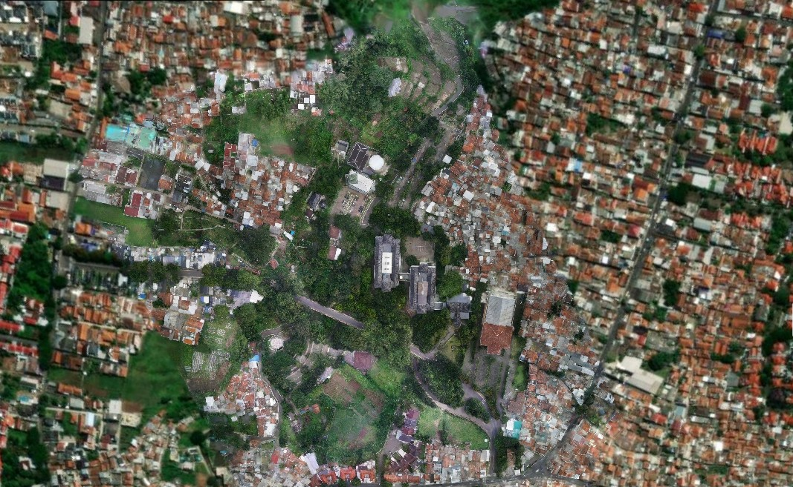
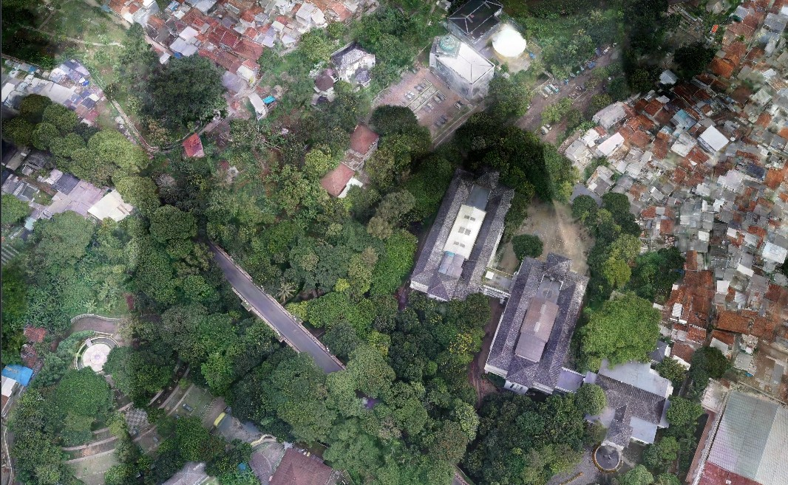
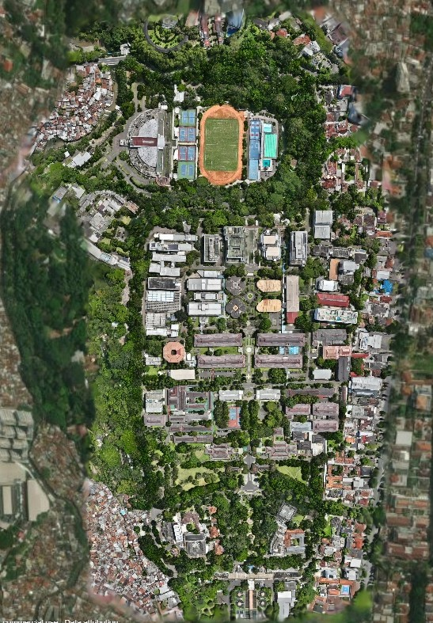
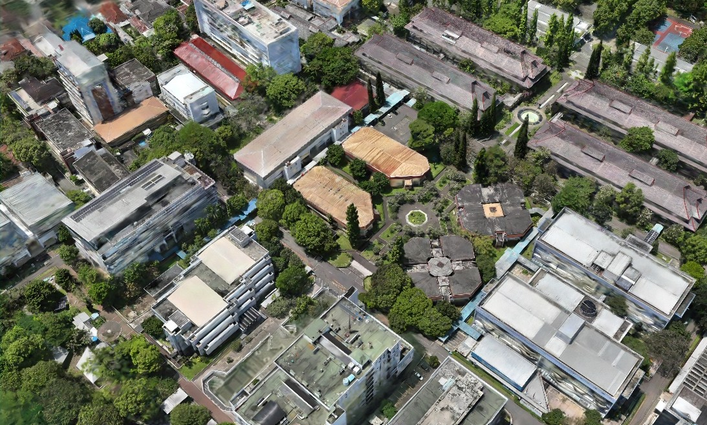

# georeference_3dtiles_gaussian_splatting

Standalone Python pipeline for converting 3D Gaussian Splatting reconstructions into georeferenced 3D Tiles 1.1 (SPZ-compressed) ready for Cesium ion and CesiumJS — without requiring LichtFeld Studio.

Tested on two real-world drone datasets in Bandung, West Java, Indonesia. Horizontal positioning appears consistent with GPS PPK references. Further geodetic validation with independent checkpoints is recommended.

---

## Features

- Direct COLMAP → ECEF georeferencing
- No LichtFeld Studio dependency
- SPZ-compressed Gaussian Splats
- 3D Tiles 1.1 export
- Cesium ion compatible
- Octree-based spatial tiling
- Optional sparse-point verification using points3D.bin
- Fully reproducible command-line workflow

---

## Intended Workflow

This project is intended for users who:

- Train Gaussian Splatting scenes using COLMAP
- Export GPS-referenced cameras from Metashape
- Need georeferenced 3D Tiles for Cesium ion or CesiumJS
- Prefer a fully scriptable workflow without requiring LichtFeld Studio

---

## What Changed from the Original Plugin

This pipeline is built on top of [dozeri83/geo-register-plugin](https://github.com/dozeri83/geo-register-plugin).
The following changes were made:

**Removed LichtFeld Studio dependency** — reads COLMAP `images.bin` directly instead
of relying on the LFS camera API. LFS v0.5.2 introduced changes to coordinate-space
handling. For our workflow, obtaining a consistent transform between camera positions
and exported PLY coordinates became difficult, so the pipeline was redesigned to
operate directly from COLMAP data.

**Direct COLMAP → ECEF transform** — solves similarity directly from COLMAP camera
centres to GPS ECEF, bypassing the Metashape scene-space intermediate. PLY splats
and COLMAP cameras share the same coordinate space, so this eliminates the need for
`node.world_transform`.

**Removed `diag(1, -1, -1)` flip** — this flip was designed for LFS visualizer-world
convention and does not apply to COLMAP output space. Removing it corrects the
altitude from negative values to the correct terrain level.

**Added octree tiling** — the original plugin exports all splats as a single GLB.
For large scenes this causes Cesium to skip the tile entirely. Octree splitting with
`geometricError = bbox diagonal` per node makes Cesium render tiles progressively.

**Fixed `geometricError`** — removed scale multiplication. `geometricError` is in
local tile space; the transform matrix handles the coordinate change.

**Fixed `refine: "ADD"` → `"REPLACE"`** — `ADD` requires parent LOD splats which
do not exist in single-level exports.

**Added `points3D.bin` reader** — optional verification of terrain altitude before
running the full tile export.

---

## Pipeline Overview

```
COLMAP images.bin ──→ Camera Centres ──┐
                                       ├──→ Similarity Solver ──→ Transform Matrix
Metashape XML ──→ GPS ECEF ────────────┘                                │
                                                                        ▼
                                                              Gaussian Splat PLY
                                                                        │
                                                                        ▼
                                                                 Octree Tiling
                                                                        │
                                                                        ▼
                                                                  SPZ Encoding
                                                                        │
                                                                        ▼
                                                                 3D Tiles 1.1
                                                                        │
                                                                        ▼
                                                            Cesium ion / CesiumJS
```

---

## Requirements

```bash
pip install -r requirements.txt
```

Current dependency:

```
numpy >= 1.24
```

---

## Inputs

| File | Description |
|---|---|
| `splat.ply` | Binary Gaussian Splat PLY |
| `sparse/0/images.bin` | COLMAP sparse reconstruction cameras |
| `camera_export.xml` | Metashape camera export (WGS84 / EPSG:4326) |
| `sparse/0/points3D.bin` | Optional sparse point cloud for verification |

**Metashape export:** File → Export → Export Cameras → set chunk CRS to **WGS84 (EPSG:4326)**.
Camera label stems in `images.bin` must match XML labels.

---

## Usage

### Step 1 — Solve Similarity Transform

```bash
python solve_transform.py \
    --images-bin sparse/0/images.bin \
    --metashape camera_export.xml \
    --points3d sparse/0/points3D.bin \
    --output similarity_transform.json
```

Example output:

```
343 cameras read
341 GPS cameras loaded
68,502 sparse points read

Matched 341 cameras (COLMAP <-> Metashape XML)
Solver: 341/341 inliers, RMSE=0.0762 m
Camera centroid -> lat=-6.87067, lon=107.55432, alt=917.19 m (drone altitude)
Sparse points -> terrain alt: 790.6-839.2 m (mean=812.8 m)

scale       = 1.00000000
RMSE (GPS)  = 0.0762 m
inliers     = 341/341
```

### Step 2 — Export 3D Tiles

```bash
python tiles_exporter.py \
    splat.ply \
    similarity_transform.json \
    output_tiles/
```

| Parameter | Description |
|---|---|
| `--max-sh-degree` | Maximum SH degree (0–3) |
| `--max-splats-per-tile` | Override automatic tile sizing |
| `--min-tile-size` | Minimum octree cell size |
| `--fraction` | Subsample splats for testing |

### Step 3 — Verify Export

```bash
python verify_tileset.py output_tiles/
```

### Step 4 — Upload to Cesium ion

1. Open Cesium ion
2. Click Add Data
3. Select 3D Tiles
4. Upload the generated `output_tiles/` directory

Use this Sandcastle snippet to render and measure altitude offset.
Replace `ASSET_ID` and `defaultAccessToken` with your values:

```javascript
const ASSET_ID = 0; // <- replace

Cesium.Ion.defaultAccessToken = "your_token_here"; // <- replace

const viewer = new Cesium.Viewer("cesiumContainer", {
  terrain: Cesium.Terrain.fromWorldTerrain(),
});

const tileset = await Cesium.Cesium3DTileset.fromIonAssetId(ASSET_ID);
viewer.scene.primitives.add(tileset);
await viewer.zoomTo(tileset);

// Optional: raise tileset vertically in local ENU space
// Adjust the Z value (metres) to lift splats above terrain clipping
// const center = tileset.boundingSphere.center;
// const enuTransform = Cesium.Transforms.eastNorthUpToFixedFrame(center);
// const translation = Cesium.Matrix4.multiplyByPoint(
//   enuTransform,
//   new Cesium.Cartesian3(0, 0, 10),  // <- adjust height offset here
//   new Cesium.Cartesian3()
// );
// const offset = Cesium.Cartesian3.subtract(translation, center, new Cesium.Cartesian3());
// tileset.modelMatrix = Cesium.Matrix4.fromTranslation(offset);

const info = document.createElement("div");
info.style.cssText = `
  position:absolute; top:10px; left:10px; z-index:999;
  background:rgba(0,0,0,0.75); color:#fff;
  font:13px monospace; padding:12px 16px; border-radius:6px;
  max-width:360px; line-height:1.6;
`;
info.innerHTML = "Click on the splat to measure altitude offset";
document.getElementById("cesiumContainer").appendChild(info);

viewer.screenSpaceEventHandler.setInputAction(async (click) => {
  const pickedPos = viewer.scene.pickPosition(click.position);
  if (!Cesium.defined(pickedPos)) {
    info.innerHTML = "Click directly on the splat model.";
    return;
  }

  const cartographic = Cesium.Ellipsoid.WGS84.cartesianToCartographic(pickedPos);
  const lat = Cesium.Math.toDegrees(cartographic.latitude);
  const lon = Cesium.Math.toDegrees(cartographic.longitude);
  const splatAlt = cartographic.height;

  const terrainPositions = [Cesium.Cartographic.fromDegrees(lon, lat)];
  const sampledTerrain = await Cesium.sampleTerrainMostDetailed(
    viewer.terrainProvider,
    terrainPositions
  );
  const terrainAlt = sampledTerrain[0].height;
  const offset = splatAlt - terrainAlt;

  const offsetColor = Math.abs(offset) < 30 ? "#7fff7f" : "#ff7f7f";
  const offsetLabel = Math.abs(offset) < 5
    ? "Near perfect"
    : Math.abs(offset) < 25
    ? "Likely geoid offset (~21m EGM96)"
    : "Large offset — check transform";

  info.innerHTML = `
    <b>Clicked point</b><br>
    Lat : ${lat.toFixed(6)}<br>
    Lon : ${lon.toFixed(6)}<br>
    <br>
    <b>Altitudes (ellipsoidal WGS84)</b><br>
    Splat alt  : <b>${splatAlt.toFixed(2)} m</b><br>
    Terrain alt: <b>${terrainAlt.toFixed(2)} m</b><br>
    <br>
    <b>Offset (splat - terrain)</b><br>
    <span style="color:${offsetColor}; font-size:16px">
      <b>${offset >= 0 ? "+" : ""}${offset.toFixed(2)} m</b>
    </span><br>
    <span style="color:#aaa; font-size:11px">${offsetLabel}</span>
  `;

  viewer.entities.removeAll();
  viewer.entities.add({
    position: pickedPos,
    point: { pixelSize: 10, color: Cesium.Color.YELLOW },
  });

}, Cesium.ScreenSpaceEventType.LEFT_CLICK);
```

---

## Validation Result

Tested on two drone datasets in Bandung, West Java, Indonesia.
GPS RMSE reflects the fit of the similarity transform against GPS PPK camera positions.
Absolute geodetic accuracy has not been independently verified — further validation
with ground control points is recommended.

| Dataset | Splats | GPS Cameras | Tiles | GPS RMSE |
|---|---|---|---|---|
| Taman Kota Cimahi | 4,999,683 | 341 PPK | 463 | 0.076 m |
| ITB Ganesha, Bandung | 8,999,938 | 1,146 PPK | 698 | 0.022 m |

**Taman Kota Cimahi**



**ITB Ganesha, Bandung**




During visual inspection in Cesium ion, horizontal positioning appeared consistent
with known geographic features. Vertical positioning was not independently verified
against ground truth measurements.

---

## File Structure

```
georeference_3dtiles_gaussian_splatting/
├── solve_transform.py
├── tiles_exporter.py
├── verify_tileset.py
├── colmap_reader.py
├── metashape_parser.py
├── transform_solver.py
├── spz_encode.py
├── requirements.txt
├── README.md
├── PIPELINE_DEBUG_LOG.md
└── LICENSE
```

---

## Troubleshooting

**Only N cameras matched** — camera labels in `images.bin` must match labels in Metashape XML:

```bash
python -c "from colmap_reader import read_images_bin; print(list(read_images_bin('sparse/0/images.bin').keys())[:5])"
python -c "from metashape_parser import parse_metashape_xml; d=parse_metashape_xml('cam.xml'); print([c['name'] for c in d['cameras'][:5]])"
```

**No chunk transform found** — re-export cameras from Metashape with chunk CRS = WGS84 (EPSG:4326).

**Splats clipping into terrain** — uncomment the ENU height offset block in the Sandcastle snippet above.

**Large scenes (>3km)** — use `--max-splats-per-tile` to increase tile count.
SPZ v3 uses 24-bit fixed-point with ±2048 unit range.

---

## Acknowledgements

This project builds upon ideas and implementations from:

- **[dozeri83/geo-register-plugin](https://github.com/dozeri83/geo-register-plugin)** —
  the original LichtFeld Studio georeferencing plugin. The following components were
  adapted from this work: SPZ encoding, similarity transform estimation, Metashape XML
  parsing, and 3D Tiles export structure. Special thanks to dozeri83 for creating and
  maintaining this plugin, which served as both the foundation and inspiration for this work.

- **[Niantic SPZ](https://github.com/nianticlabs/spz)** — SPZ v3 binary format specification (MIT License).

Additional implementation details, design decisions, and investigation notes can be found in `PIPELINE_DEBUG_LOG.md`.

---

## License

GPL-3.0

SPZ encoder implementation follows the Niantic SPZ specification (MIT License).
